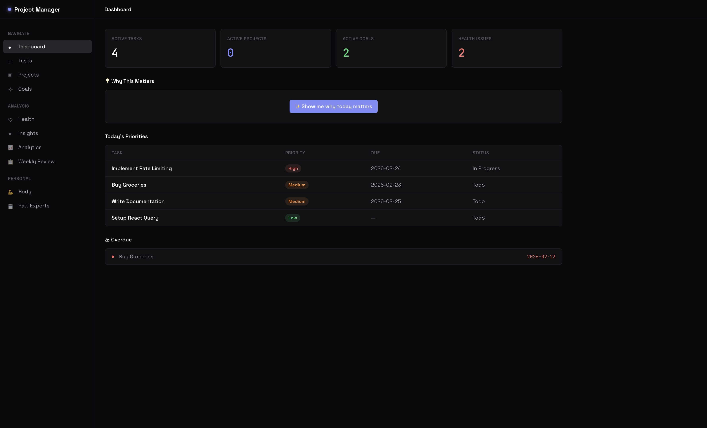
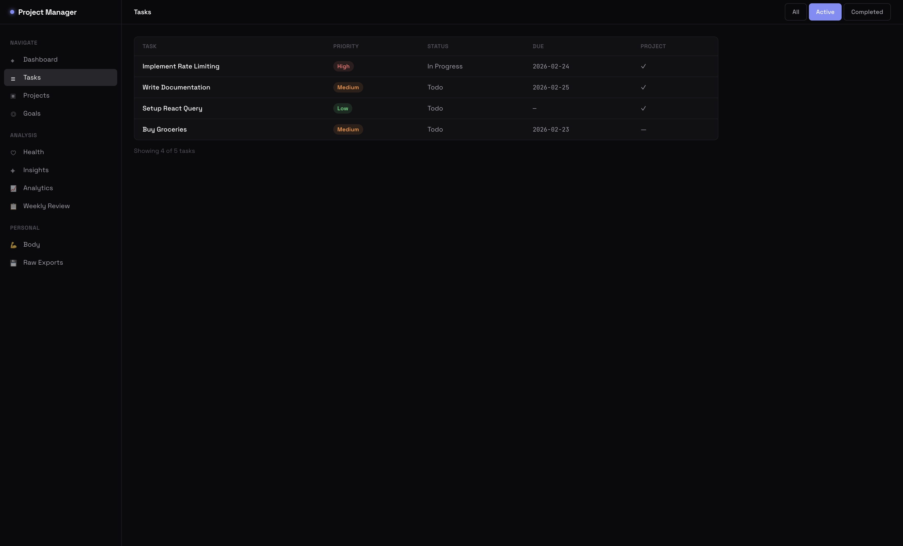
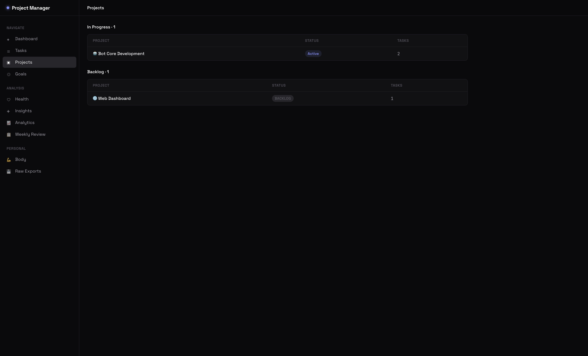
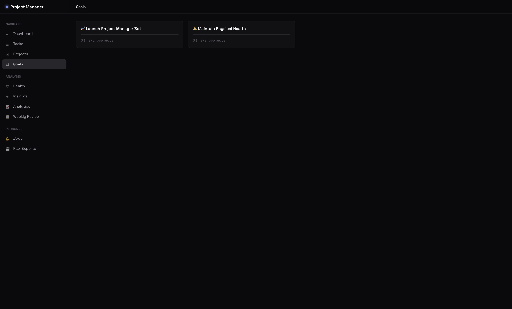
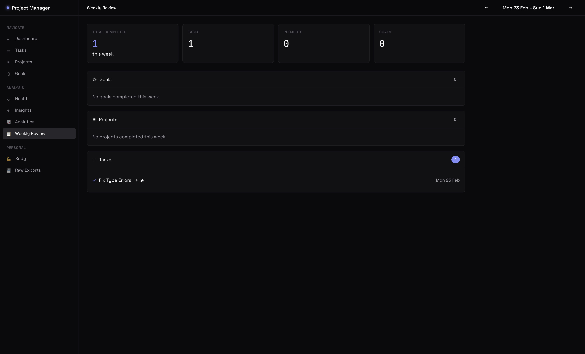
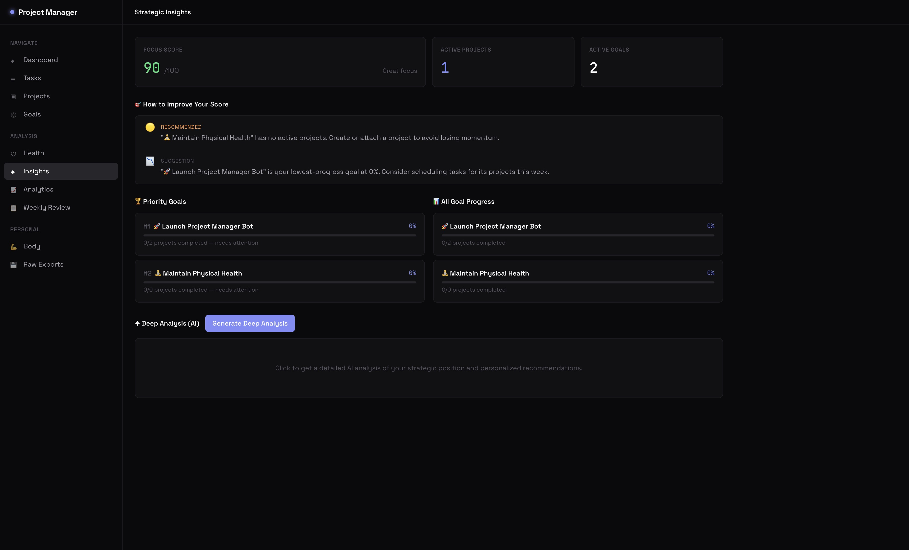
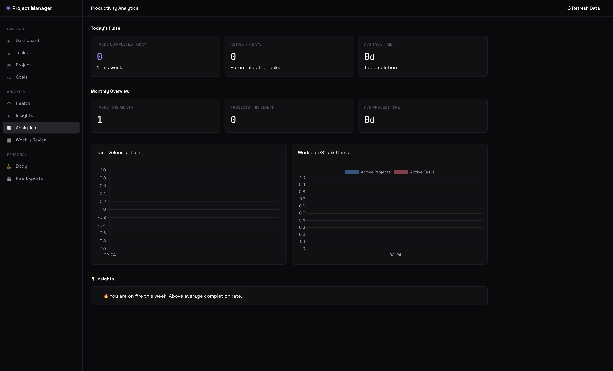
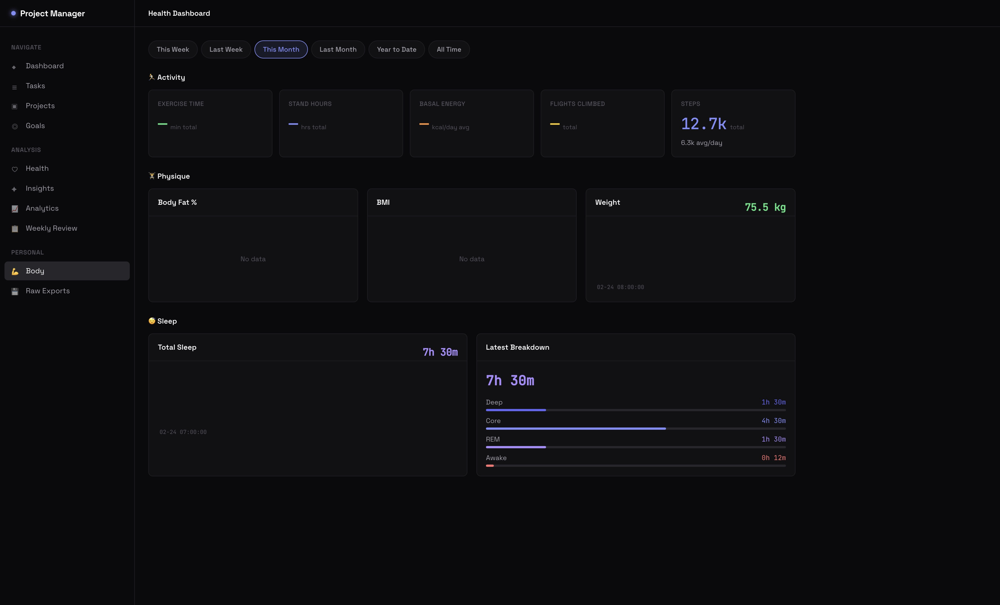
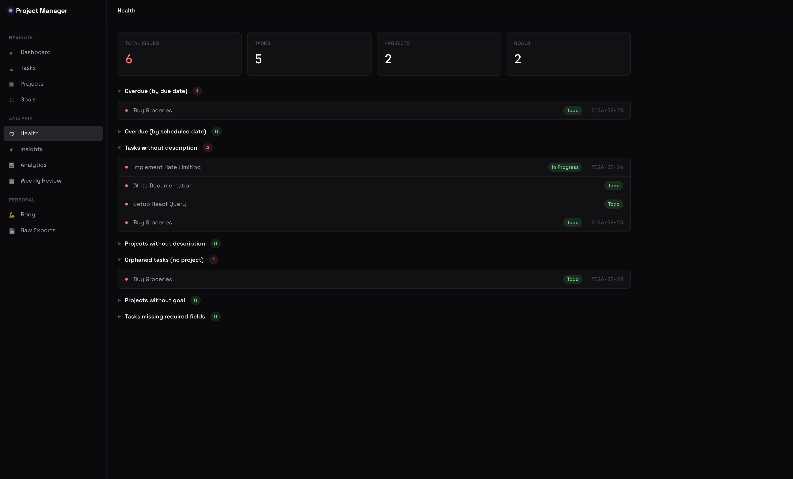

# Project Manager Bot

A hybrid **Telegram bot + web dashboard** for personal project management — backed by Notion, augmented with Google Gemini AI, and integrated with Apple Health for a holistic view of how work and well-being interact.

[](https://github.com/WesleySmits/project-manager-bot/actions/workflows/ci.yml)
[](LICENSE)
[](https://nodejs.org)
[](https://www.typescriptlang.org/)
[](https://react.dev)



---

## Why this exists

Most productivity tools either lock you into their data model or stop at task lists. This project takes a different path:

- **Notion is the source of truth** — no SQL database, no migrations, no vendor lock-in. Your goals, projects, and tasks stay editable in the tool you already use.
- **The bot is the daily driver** — Telegram for friction-free capture and morning briefings.
- **The dashboard is the strategist** — a Linear-inspired SPA for weekly reviews, data-health diagnostics, and AI-driven advice.
- **Health data lives alongside your work** — because productivity is downstream of sleep, activity, and recovery.

It's opinionated about focus: **one top goal, one top project, three top tasks per day.** The system enforces this in both the briefing and the dashboard.

---

## Features

### Daily execution
- **Morning briefing** via Telegram with the day's top-down focus (goal → project → tasks)
- **Quick capture and completion** through bot commands (`/today_tasks`, `/done`, `/snooze`)
- **Productivity score** (0–100) that gamifies consistency

### Strategic planning
- **Goal → Project → Task hierarchy** synced from Notion
- **Weekly review** with progress, blockers, and stalled-project detection
- **AI strategist** powered by Gemini — surfaces priorities, blind spots, and rebalancing suggestions
- **Category locks** to enforce one goal per life domain

### Diagnostics
- **Data health dashboard** — surfaces orphaned tasks, zombie projects, stale goals, and freshness gaps
- **System status** for Notion connectivity and last sync

### Health integration
- **Apple Health import** via Health Auto Export → JSON ingest
- **Body & activity charts** correlated with productivity trends

### Architecture
- **Single container** — Express serves both the REST API and the React SPA, alongside the Telegraf bot
- **JWT auth** with HTTP-only cookies for the dashboard, static API key for machine callers
- **Strict TypeScript** end to end

---

## Screenshots

<table>
  <tr>
    <td align="center"><b>Command Center</b><br/></td>
    <td align="center"><b>Tasks</b><br/></td>
  </tr>
  <tr>
    <td align="center"><b>Projects</b><br/></td>
    <td align="center"><b>Goals</b><br/></td>
  </tr>
  <tr>
    <td align="center"><b>Weekly Review</b><br/></td>
    <td align="center"><b>AI Insights</b><br/></td>
  </tr>
  <tr>
    <td align="center"><b>Analytics</b><br/></td>
    <td align="center"><b>Body & Health</b><br/></td>
  </tr>
  <tr>
    <td align="center" colspan="2"><b>Data Health Diagnostics</b><br/></td>
  </tr>
</table>

---

## Tech stack

| Layer | Technology |
|---|---|
| Runtime | Node.js 24+, TypeScript 5.9 (strict) |
| Backend | Express 5, Telegraf 4 |
| Frontend | React 19, Vite 7, React Router 7, Chart.js |
| Data | Notion API (raw HTTP, paginated), local JSON for health |
| AI | Google Gemini (`@google/generative-ai`) |
| Auth | JWT (HTTP-only cookies, 7-day expiry) |
| Container | Docker (Alpine) |
| Tests | Vitest |

The whole thing runs in a single Node process: Express serves the SPA and REST API while Telegraf handles bot polling. See [WEB_INTERFACE_README.md](./WEB_INTERFACE_README.md) for the architecture diagram.

---

## Telegram commands

| Command | Description |
|---|---|
| `/start` | Welcome and command overview |
| `/morning` | Daily briefing with top goal, project, and three tasks |
| `/today_tasks` | List today's prioritized tasks |
| `/done <id>` | Mark a task complete |
| `/snooze <id>` | Push a task to tomorrow |
| `/task <description>` | Quick-capture a new task |
| `/strategy` | AI strategic analysis of the current portfolio |
| `/improve` | AI suggestions for rebalancing focus |
| `/score` | Show today's productivity score |
| `/score_adjust` | Manually adjust the score |
| `/notion_health` | Run data-health diagnostics |

---

## Getting started

### Prerequisites
- Node.js 24 or newer
- A Notion workspace and integration token
- A Telegram bot token (via [@BotFather](https://t.me/botfather))
- A Google Gemini API key (optional but recommended)

### 1. Set up Notion

You need three databases. The fastest way is to ask Notion AI to create them with these prompts:

**Goals**
> Create a 'Goals' database with the following properties: 'Name' (Title), 'Status' (Status: In Progress, Done), 'Completed Date' (Date), 'Description' (Rich Text), and a Relation to a 'Projects' database.

**Projects**
> Create a 'Projects' database with the following properties: 'Name' (Title), 'Status' (Select: Backlog, Ready to Start, In Progress, Ready for Review, Done, Parked), 'Goal' (Relation to Goals), 'Blocked?' (Checkbox), 'Evergreen' (Checkbox), 'Completed Date' (Date), 'Description' (Rich Text), and a Relation to a 'Tasks' database.

**Tasks**
> Create a 'Tasks' database with the following properties: 'Name' (Title), 'Status' (Status: To Do, In Progress, Done, Cancelled), 'Priority' (Select: P0, P1, P2, P3), 'Project' (Relation to Projects), 'Due Date' (Date), 'Scheduled' (Date), 'Task ID' (Unique ID), and 'Description' (Rich Text).

Then share each database with your Notion integration and copy the database IDs from their URLs.

### 2. Configure environment

Copy `.env.example` to `.env` and fill in the values:

| Variable | Required | How to get it |
|---|:---:|---|
| `TELEGRAM_BOT_TOKEN` | ✅ | [@BotFather](https://t.me/botfather) on Telegram |
| `TELEGRAM_CHAT_ID` | ✅ | [@userinfobot](https://t.me/userinfobot) |
| `NOTION_TOKEN` | ✅ | [Notion integrations](https://www.notion.so/my-integrations) |
| `NOTION_TASKS_DB` | ✅ | Tasks database ID |
| `NOTION_PROJECTS_DB` | ✅ | Projects database ID |
| `NOTION_GOALS_DB` | ✅ | Goals database ID |
| `JWT_SECRET` | ✅ | `node -e "console.log(require('crypto').randomBytes(32).toString('hex'))"` |
| `BASIC_AUTH_USER` | ✅ | Dashboard login username |
| `BASIC_AUTH_PASS` | ✅ | Dashboard login password |
| `GEMINI_API_KEY` |  | [Google AI Studio](https://aistudio.google.com/) |
| `API_KEY` |  | Static key for machine callers (same generator as `JWT_SECRET`) |
| `NOTION_HEALTH_DB_ID` |  | Notion Health Metrics database ID |

The server refuses to start if any required variable is missing.

### 3. Install and run

```bash
npm install
npm run build              # tsc + vite build
node dist/index.js         # runs bot + API + serves SPA on :3301

# Or, for frontend hot reload during development:
npm run dev:web            # vite on :5173, proxies /api → :3301
```

### 4. Run tests

```bash
npm test
```

---

## Deployment (Docker)

The application ships as a single Alpine-based container.

> **⚠️ Persist `/app/data`.** Apple Health exports are stored as JSON in `/app/data`. Mount a volume there or every redeploy will wipe your history.

Example Dokploy configuration:
- **Host path**: `/your/host/path/data`
- **Container path**: `/app/data`

---

## Apple Health integration

1. Install [Health Auto Export](https://github.com/Lybron/health-auto-export) (or any iOS app that POSTs Health JSON).
2. Configure it to POST to `https://your-domain.com/api/health-data` with header `X-API-Key: $API_KEY`.
3. Valid exports are written to `data/health/` and rendered on the **Body & Health** dashboard.

---

## Project structure

```
index.ts                  Express server + Telegram bot entry point
src/
  ai/gemini.ts            Google Gemini integration
  analytics/              Daily metrics collection and snapshots
  commands/               Telegram bot command handlers
  health/                 Apple Health data store
  middleware/             JWT auth
  notion/                 Notion API client + workspace diagnostics
  pm/strategy.ts          Strategic analysis engine
  routes/                 REST API routers
  web/                    React SPA (Vite)
docs/API.md               Complete REST API reference
```

Conventions:
- **No SQL.** All structured data goes through the Notion API.
- **No caching layer.** Every API request queries Notion live (analytics snapshots are the one exception).
- **Project status is centralized.** Use `getProjectStatusCategory()` and friends in `src/notion/client.ts` rather than hardcoded strings.

See [CLAUDE.md](./CLAUDE.md) for the agent-facing guide.

---

## Roadmap

See [ROADMAP.md](./ROADMAP.md) for planned features. Highlights:
- Multi-team workspaces
- Slack and email integrations
- Natural-language command parsing
- Task dependency graphs

---

## License

[MIT](./LICENSE) © Wesley Smits
