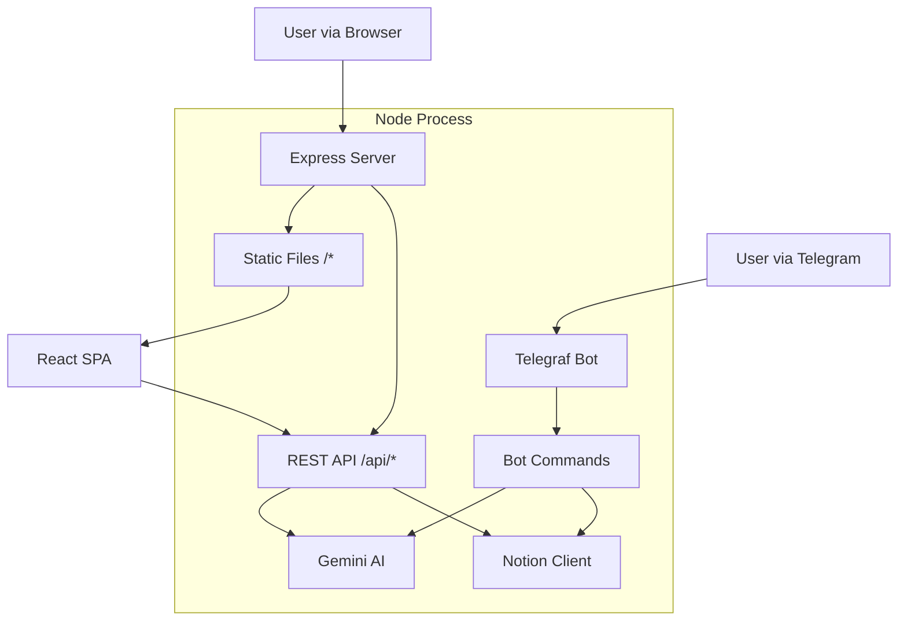

# Web Interface Plan

## 🎯 Objective
Create a premium, modern web interface for the Project Manager Bot that:
- Visualizes Tasks, Projects, and Goals.
- Highlights Data Health issues (orphaned tasks, zombie projects).
- Provides AI-driven insights for lifestyle and productivity optimization.
- Runs alongside the existing Telegram Bot in a single repo/container.

## 🏗 Architecture

We will transform the current application into a **Hybrid Monolith**:
- **Backend**: The existing `index.ts` will accept an upgrade from `http` module to `Express.js`.
    - It will continue to run the Telegram Bot polling/webhook.
    - It will expose a REST API for the frontend.
    - It will serve the static frontend assets.
- **Frontend**: A Single Page Application (SPA) built with **Vite + React + TypeScript**.
    - Located in `src/web`.
    - Bundled into `dist/web`.

### Diagram

## 🛠 Tech Stack

### Backend
- **Framework**: `Express.js` (replaces native `http` server)
- **Language**: TypeScript
- **Runtime**: Node.js (Alpine)

### Frontend
- **Build Tool**: `Vite`
- **Framework**: `React`
- **Language**: TypeScript
- **Styling**: **Vanilla CSS** (CSS Variables for themes, Flexbox/Grid for layout).
    - **Design Language**: **Linear-style Minimalism**.
    - **Characteristics**: Dark mode by default, high contrast, subtle borders, Inter font, micro-interactions, keyboard-centric (command K).
    - **Philosophy**: Content-first, high density but breathable, fast.
- **State Management**: React Context or lightweight store (Zustand) if needed.
- **Routing**: `react-router-dom`

### Data Sources
- **Primary**: Notion API (via existing client).
- **Intelligence**: Google Gemini (via existing `src/ai`).

## 🔌 API Design

The backend will expose these endpoints:

| Method | Endpoint | Description |
| :--- | :--- | :--- |
| `GET` | `/api/health` | System status (Bot, Notion connection) |
| `GET` | `/api/dashboard` | Aggregated metrics (Task count, Project count, Health score) |
| `GET` | `/api/tasks` | List of tasks (supports query params for filter/sort) |
| `GET` | `/api/projects` | List of active projects with progress |
| `GET` | `/api/goals` | List of life goals and their status |
| `GET` | `/api/analysis/health` | Detailed health report (Orphans, Zombies, etc.) |
| `POST` | `/api/ai/insight` | Trigger on-demand AI strategic advice |

## 🎨 Views & UI/UX

### 1. **Command Center (Dashboard)**
- **Header**: Greeting + "Morning Briefing" summary status.
- **Key Metrics Row**: "Active Projects", "Open Tasks", "Health Score".
- **Focus Area**: Top 3 Priorities for today (Visual cards).

### 2. **Task Board**
- **Views**: List view and Kanban view (Todo -> Doing -> Done).
- **Features**: Filter by Priority, Project, or Context.
- **Visuals**: Color-coded badges for priority.

### 3. **Strategy Room (Projects & Goals)**
- **Visual**: Goal Hierarchy Tree.
    - Top Level: Goals (Progress bars).
    - Children: Projects linked to goals.
- **Status**: Visual indicators for "Stalled" or "On Track".

### 4. **Health & Diagnostics**
- **Visual**: "System Status" style dashboard.
- **Components**:
    - **Orphan Registry**: List of tasks with no project.
    - **Zombie Hunter**: Projects with no active tasks.
    - **Freshness**: Last sync timestamps.
- **Actions**: "Fix" buttons (links to Notion).

### 5. **Oracle (AI Insights)**
- **Interface**: Chat-like or Feed interface.
- **Content**: Strategic advice generated by Gemini.
- **Actions**: "Generate New Insight".

## 🚀 Implementation Steps

### Phase 1: Backend Restructuring
1. Install `express`, `cors`, `helmet`.
2. Refactor `index.ts` to use Express.
3. Create API routes in `src/routes/*.ts`.

### Phase 2: Frontend Setup
1. Initialize Vite React app in `src/web`.
2. Configure `vite.config.ts` to build to `dist/web`.
3. Set up basic Routing and Layouts.
4. Implement "Premium" Design System (CSS Variables, keyframes).

### Phase 3: Feature Implementation
1. Connect Dashboard to `/api/dashboard`.
2. Build Task and Project views.
3. Implement AI Insight fetching.

### Phase 4: Integration & Deployment
1. Update `package.json` with `build:web` script.
2. Update `Dockerfile` to build frontend assets.
3. Verify `express` serves static files correctly in production.

## 📦 Deployment Constraints
- **One Repo**: Frontend code lives in `src/web`.
- **One Container**: One Docker image contains both backend and frontend build.
- **Concurrent Run**: Express serves both API and Web UI.
